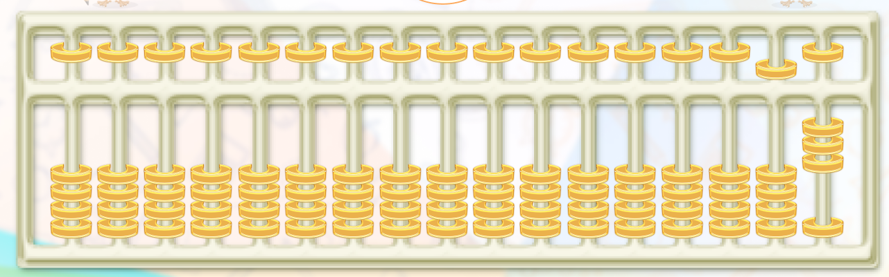
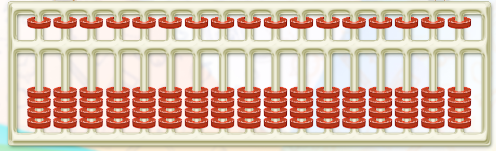
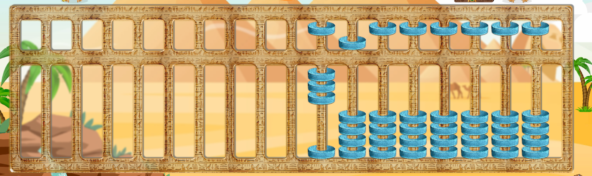
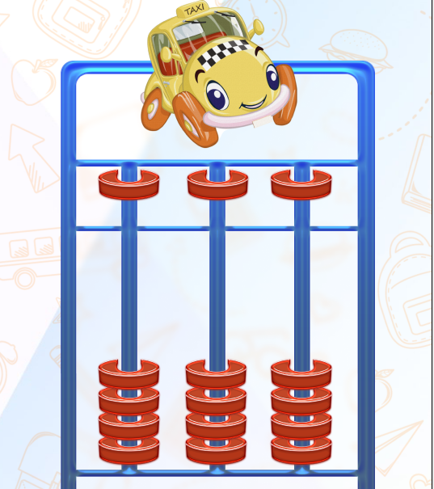
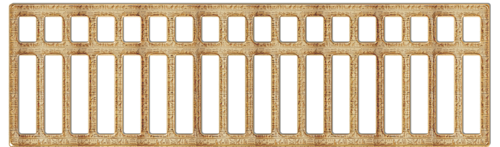
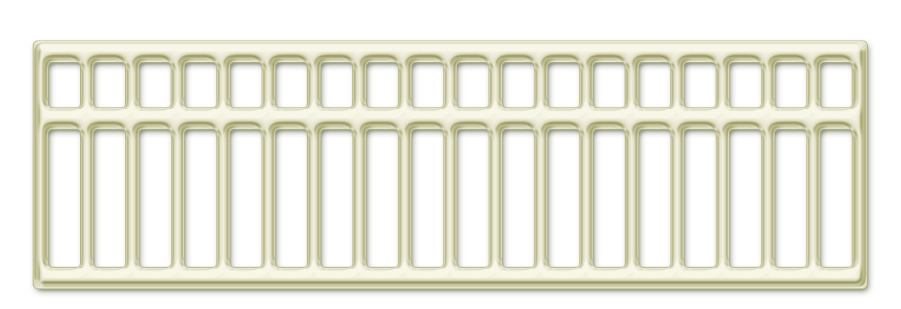

**Задача:**

Сверстать рамку и косточки абакуса (счеты), внешний вид абакуса:

**Требование по задаче:**

*1) скин косточки должен быть сменный.*

Пример (сменный скин косточки):

*2) скин рамки должен быть сменный.*

Пример (сменный скин
рамки):

*3) Длина абакуса сменная (может быть произвольная).*

Пример (короткий абакус):

*4) Количество косточек на одном стержне может быть разным (количество
может быть произвольным).*

**Требование по выполнению:**

1.  Сверстать с использованием библиотеки reactjs

2.  Смена скинов должна выполняться динамически, например при выборе
    нужного цвета

3.  Длина абакуса и количества косточек должна меняться динамически, при
    указании количества стержней или количества косточек сверху и
    снизу от среднего разделителя.

**Результат :**

Можно в любом формате. (git, codesanbox, html файл)

**Материалы:**

